# 🤖 Weekly AI News Recap

Automated Monday morning AI news digest — pulls from 28+ sources, uses Claude to filter and summarize, delivers a personalized email every week.

## Why I Built This

As a consultant focused on Salesforce AI (AgentForce), I need to stay current on enterprise AI, frontier models, and developer tools. Rather than manually scanning 20+ sources daily, I built an automated pipeline that curates and summarizes the most relevant news each week.

Built with AI-assisted development (Claude) — a practical example of “vibe coding” applied to a real productivity problem.

## How It Works

```mermaid
graph LR
    A[📡 RSS Feeds<br/>28+ sources] --> B[🐍 Python Script]
    C[📰 NewsAPI<br/>optional] --> B
    B --> D[🧹 Deduplication]
    D --> E[🤖 Claude API<br/>Sonnet]
    E --> F[📧 HTML Email]
    F --> G[Gmail SMTP]
    H[⏰ GitHub Actions<br/>Monday 7am] -.-> B
```



1. **Fetches** articles from 28 RSS feeds across 6 categories
1. **Deduplicates** by URL and title similarity
1. **Sends to Claude** with a custom system prompt tuned to my interests
1. **Emails** a clean, scannable HTML digest every Monday morning
1. **Runs serverless** via GitHub Actions — zero infrastructure

## Feed Categories

|Category                    |Feeds|Examples                                                                |
|----------------------------|-----|------------------------------------------------------------------------|
|🏢 Enterprise AI / Salesforce|6    |Salesforce Blog, Salesforce AI, SF Engineering, Microsoft AI, AWS ML    |
|🤖 Anthropic / Claude        |1    |Anthropic Blog                                                          |
|🧪 Frontier AI Labs          |5    |OpenAI, Google AI, Meta AI, DeepMind, Mistral                           |
|🛠️ AI Dev Tools              |3    |Hacker News (filtered), GitHub Blog                                     |
|📰 Major AI News             |6    |MIT Tech Review, The Verge, VentureBeat, TechCrunch, Ars Technica, Wired|
|💼 Consulting / Strategy     |3    |Deloitte AI Insights, McKinsey AI, HBR Technology                       |
|🧠 Thought Leaders           |5    |Simon Willison, Import AI, The Batch, One Useful Thing, Ahead of AI     |

## Quick Start

```bash
# Clone and install
git clone https://github.com/YOUR_USERNAME/ai-news-recap.git
cd ai-news-recap
pip install -r requirements.txt

# Configure (see Setup Guide below)
cp .env.example .env
# Edit .env with your API keys

# Test run
python main.py
```

## Setup

See <SETUP_GUIDE.md> for detailed step-by-step instructions, including phone-friendly setup via GitHub web UI.

## Cost

|Service            |Cost                  |
|-------------------|----------------------|
|GitHub Actions     |Free (2,000 min/month)|
|Claude API (Sonnet)|~$0.05-0.15 per run   |
|NewsAPI            |Free tier (optional)  |
|**Total**          |**~$1-2/month**       |

## Tech Stack

- **Python 3.11** — script runtime
- **Claude API (Sonnet)** — AI summarization and ranking
- **feedparser** — RSS ingestion
- **GitHub Actions** — serverless scheduling (cron)
- **Gmail SMTP** — email delivery

## License

MIT
